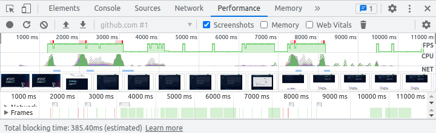

# chrome-profile-to-movie

This is a shell script that converts a page performance profile, recorded with Chrome DevTools, into a moving image composed of the profile's embedded screenshots.

In other words, it transforms something like this (which is represented as JSON):

into this:

Why, you ask? Well, why not?

## Installation

1. Make sure you have [`jq`](https://stedolan.github.io/jq/) and [`base64`](https://www.gnu.org/software/coreutils/manual/html_node/base64-invocation.html) installed and on your PATH. (The script has been tested with jq 1.6 and ffmpeg 4.2.4.)
2. Download the script, put it somewhere on your PATH, and make it executable.

## Usage

1. Record a web page performance profile using Chrome DevTools and save it.
2. Send the profile to the script's `stdin`, and redirect `stdout` to a new file with a `.gif` extension (the only output format currently supported).

Enjoy!
